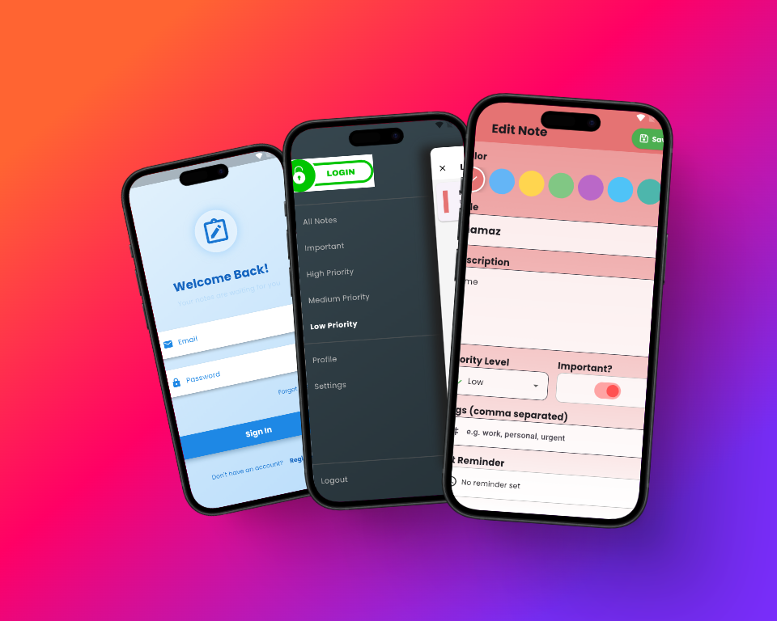

<div align="center">
  <h1>
    NoteMinder - Advanced Note Taking & Organization App
  </h1>
  <h3>A Modern Flutter App for Managing Your Notes with Priority & Organization</h3>
</div>

## 📸 Banner
<p align="center">
    
</p>

<p align="center">
    
    
    
    
</p>

## 📸 Screenshots

### Authentication & Onboarding

<table border="1">
  <tr>
    <td align="center">
      
      <p><b>Login Screen</b></p>
    </td>
    <td align="center">
      
      <p><b>Create Account</b></p>
    </td>
    <td align="center">
      
      <p><b>Sign Up Flow</b></p>
    </td>
  </tr>
</table>

### Note Management & Views

<table border="1">
  <tr>
    <td align="center">
      
      <p><b>Grid View</b></p>
    </td>
    <td align="center">
      
      <p><b>List View</b></p>
    </td>
    <td align="center">
      
      <p><b>Enhanced List View</b></p>
    </td>
  </tr>
  <tr>
    <td align="center">
      
      <p><b>High Priority Notes</b></p>
    </td>
    <td align="center">
      
      <p><b>Medium Priority Notes</b></p>
    </td>
    <td align="center">
      
      <p><b>Low Priority Notes</b></p>
    </td>
  </tr>
</table>

### Note Editing & Details

<table border="1">
  <tr>
    <td align="center">
      
      <p><b>Edit Notes</b></p>
    </td>
    <td align="center">
      
      <p><b>Note Editor</b></p>
    </td>
    <td align="center">
      
      <p><b>Note Details</b></p>
    </td>
  </tr>
</table>

### User Management & Settings

<table border="1">
  <tr>
    <td align="center">
      
      <p><b>Navigation Drawer</b></p>
    </td>
    <td align="center">
      
      <p><b>User Profile</b></p>
    </td>
    <td align="center">
      
      <p><b>Edit Profile</b></p>
    </td>
  </tr>
  <tr>
    <td align="center">
      
      <p><b>Settings</b></p>
    </td>
    <td align="center">
      
      <p><b>Search Notes</b></p>
    </td>
  </tr>
</table>

## 📱 Features

- **Modern UI**: Beautiful, intuitive interface with animations
- **Multiple Views**: Switch between grid and list views
- **Note Priority**: Organize notes by importance (High, Medium, Low)
- **Authentication**: Secure login and signup system with persistent sessions
- **User Profiles**: Create and manage your personal profile
- **Note Details**: View comprehensive information about each note
- **Search**: Quickly find notes by title, description, or tags
- **Data Persistence**: Store all your notes locally using SQLite
- **Animations**: Smooth transitions and visual effects

## 🚀 Tech Stack

- **Flutter** (UI Framework)
- **GetX** (State Management)
- **SQLite** (Local Database)
- **Shared Preferences** (Session Management)
- **Flutter Animate** (Animation Library)
- **AnimatedTextKit** (Text Animations)
- **Material Design 3**
- **Flutter Slidable** (Swipe Actions)
- **Flutter Staggered Grid View** (Grid Layout)

## 🔑 Key Features

- ✅ **Note Management**: Create, edit, and delete notes
- ✅ **Priority System**: Categorize notes by importance
- ✅ **Multiple Views**: Toggle between grid and list views
- ✅ **Tagging**: Organize notes with tags
- ✅ **User Authentication**: Secure login with persistent sessions
- ✅ **Profile Management**: Customize your user profile
- ✅ **Offline Access**: Access your notes without internet
- ✅ **Search**: Find notes quickly with powerful search functionality
- ✅ **Beautiful UI**: Modern and intuitive interface with animations

## 📖 How to Use

1. **Create an Account or Login**
   - Sign up with your email and password
   - Profile pictures can be added from camera or gallery
   - Previous sessions are remembered for seamless access

2. **Manage Your Notes**
   - Create new notes with the floating action button
   - Set priority levels (High, Medium, Low)
   - Add tags for better organization
   - Choose note colors for visual categorization

3. **Organize and Filter**
   - Use the drawer menu to filter by priority
   - Search notes by content or tags
   - Switch between grid and list views
   - Star important notes for quick access

4. **User Settings**
   - Update your profile information
   - Change app preferences
   - Manage account settings

## Project Structure

```
lib/
├── controller/
│   ├── authcontroller.dart
│   ├── notecontroller.dart
│   └── signupcontroller.dart
├── db/
│   └── sql.dart
├── model/
│   ├── note.dart
│   └── usermodel.dart
├── page/
│   ├── edit_note_page.dart
│   ├── login.dart
│   ├── note_detail_page.dart
│   ├── notes_page.dart
│   ├── profile_page.dart
│   ├── settings_page.dart
│   └── signup.dart
├── widget/
│   └── note_card_widget.dart
└── main.dart
```

## 📝 License

This project is licensed under the MIT License - see the LICENSE file for details.

## 📦 Installation

Download the APK from:
- [APK/app-release.apk](APK/app-release.apk)

Or clone the repository and build it yourself:
```bash
git clone https://github.com/yourusername/notes_app_with_sql.git
cd notes_app_with_sql
flutter pub get
flutter run
```

## 🤝 Contributing

Contributions, issues, and feature requests are welcome! Feel free to check the issues page.

## 👨‍💻 Developer

Developed with ❤️ by [Your Name]
